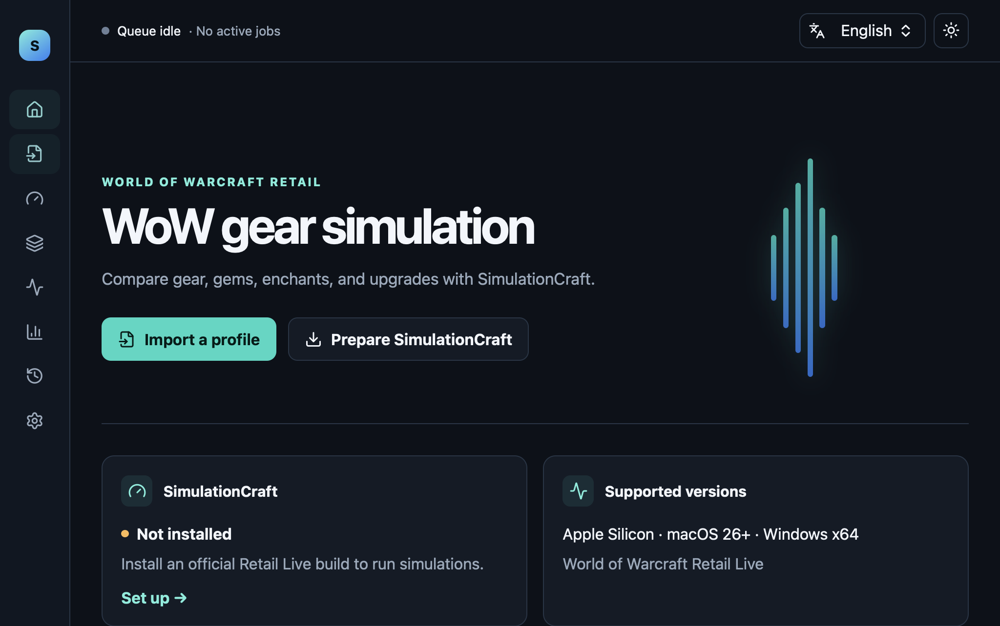

# SimShredder

World of Warcraft Retail 캐릭터를 SimulationCraft로 분석하는 로컬 데스크톱 앱입니다.

프로필 가져오기부터 캐릭터 분석, 장비 최적화, 결과 비교와 기록 관리까지 한곳에서 처리합니다. 전투 계산은 SimShredder가 재구현하지 않고 공식 SimulationCraft를 사용합니다.

## 주요 기능

- SimulationCraft addon 문자열과 `.simc` 파일 가져오기
- 캐릭터별 마지막 입력 저장, 즐겨찾기와 직전 입력 복원
- 캐릭터 분석 설정과 최종 `.simc` 입력 확인
- 착용·가방 장비를 사용한 장비 최적화
- 가상 보석, 마법부여, 업그레이드와 강화 화폐 예산 반영
- 실행 진행률, DPS·오차 범위와 상세 결과 확인
- 중단된 작업 복구, 재시도와 실행 기록 관리
- JSON, HTML, 생성 입력과 로그 export
- 한국어·영어 UI

## 지원 대상

| 지원 | 미지원 |
|---|---|
| World of Warcraft Retail Live | Classic, PTR, Beta |
| Apple Silicon macOS 26 이상 | Intel Mac |
| Windows x64 | Windows ARM64, Linux |

Windows 지원 범위는 사용하는 공식 [SimulationCraft](https://www.simulationcraft.org/download.html)의 Windows 지원 범위를 따릅니다.

## 사용 방법

1. SimulationCraft addon 문자열을 붙여 넣거나 `.simc` 파일을 선택합니다.
2. 앱의 안내에 따라 공식 SimulationCraft를 준비합니다.
3. 캐릭터 분석 또는 장비 최적화 설정과 생성될 입력을 확인한 뒤 실행합니다.
4. 결과를 비교하고 필요한 원본 산출물을 export합니다.

SimulationCraft는 앱에 포함되지 않습니다. 필요한 파일은 사용자의 동의를 받은 뒤 공식 서버에서 직접 다운로드하고 크기, SHA-256과 실행 파일 정보를 검증합니다. 새 버전이 있어도 강제로 설치하지 않습니다.

## 설치

배포 파일은 [GitHub Releases](https://github.com/DobiShredder/SimShredder/releases)에서 제공합니다.

macOS와 Windows 배포 파일에는 운영체제 publisher 서명이 없을 수 있습니다. 설치 전에 같은 Release의 checksum을 확인하고 [unsigned 설치 안내](docs/UNSIGNED_INSTALLATION.md)를 따라 주세요. SimShredder는 Gatekeeper, SmartScreen 또는 Smart App Control을 끄거나 우회하지 않습니다.

## 데이터와 개인정보

프로필, 생성된 입력, 작업 상태, 결과와 로그는 사용자의 장치에 저장됩니다. Telemetry, analytics와 자동 crash upload는 사용하지 않습니다.

- macOS 기본 위치: `~/Library/Application Support/SimShredder`
- Windows 기본 위치: `%LOCALAPPDATA%\SimShredder`
- 기본 export 위치: `Documents/SimShredder Exports`

Workspace/history, SimulationCraft, icon cache와 export 위치는 Settings에서 각각 변경할 수 있습니다. 자세한 내용은 [개인정보 및 네트워크 정책](docs/PRIVACY.md)을 확인하세요.

## 지원

버그와 테스트 피드백은 [GitHub Issues](https://github.com/DobiShredder/SimShredder/issues)에 남겨 주세요. 보안 문제는 public issue 대신 [비공개 보안 신고 절차](.github/SECURITY.md)를 사용하세요.

## 라이선스

SimShredder는 [Apache License 2.0](LICENSE)으로 공개합니다.

SimulationCraft, World of Warcraft와 관련 데이터 및 상표는 각 권리자에게 속합니다. SimShredder는 SimulationCraft 또는 Blizzard Entertainment의 공식 제품이 아닙니다.
